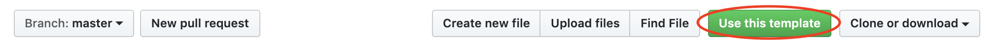

# ☁️ myClubs Backend Challenge

myClubs has grown as a company. To make the growing complexity manageable, we have moved distinct workloads to separate systems.
The workload for this challenge concerns **weather**.

## 😎 Scenario

Outdoor courses are likely to be cancelled if the weather is bad so we want to be able to get a forecast for a specific workout.
The product owner has provided you with some example data for workouts and would like you to implement an API endpoint where they can pass a workout and get a weather forecast for it.

* Implement a function that takes the `objectId` of an `ActivityDate` (workout), loads the weather forecast from a source of your choice and responds with an object containing the ActivityDate and the weather forecast. Your starting point is `handler/getWeather/getWeather.ts`
* All functionality should be available via HTTPS and require a token to be accessible.

## ✅ Test

* Write a basic test case for your function.

## 👟 Getting Started

You can use this GitHub repository as a template for your own repository:

The project has already been initialized as a [AWS CDK](https://docs.aws.amazon.com/cdk/api/latest/docs/aws-construct-library.html) typescript project. If you’re new to AWS CDK, the [typescript workshop](https://cdkworkshop.com/20-typescript.html) is a good starting point.

You can install the project dependencies with `yarn install` and run the tests with `yarn test`.

We’re looking for your *personal* solution, so feel free to solve the challenge your own way. Nevertheless, we’re happy to help and answer any questions that arise!

## 📦 Deliverable

Use this repository as a template for your own, and submit you results as pull request on your repository.
